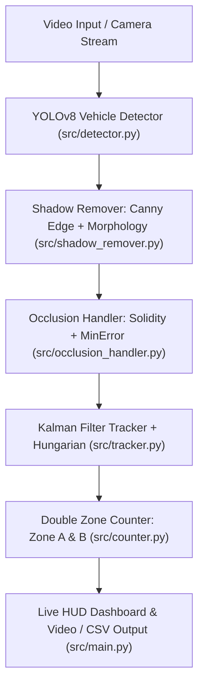

# Vehicle Counting & Tracking System using YOLOv8

ระบบตรวจจับ ติดตาม และนับจำนวนยานพาหนะอัจฉริยะ (Vehicle Counting and Tracking System) พัฒนาด้วย **YOLOv8** ร่วมกับเทคนิคการประมวลผลภาพขั้นสูง (Advanced Computer Vision):
- **Canny Edge & Morphological Operations**: สำหรับตัดเงาของรถยนต์บนพื้นถนนในสภาพแดดจ้า (Sunny)
- **Solidity Criterion & MinError Splitting**: สำหรับแยกวัตถุที่ซ้อนทับหรือบดบังกันในสภาพการจราจรหนาแน่น (Heavy Traffic)
- **Kalman Filter Tracking**: สำหรับติดตามยานพาหนะอย่างเสถียรและกำหนด Track ID ต่อเนื่อง
- **Double Zone Counting Logic**: สำหรับตรวจนับทิศทาง (Inbound / Outbound) อย่างแม่นยำ ป้องกันการนับซ้ำ 100%

---

## 📁 โครงสร้างโปรเจกต์ (Project Structure)

```text
vehicle-counting-yolov8/
├── data/                               # วิดีโอจราจรสำหรับทดสอบ
│   ├── thai_highway.mp4               # วิดีโอทางหลวงประเทศไทย (1080p, รถจริง)
│   ├── highway_traffic_test.mp4       # วิดีโอทางหลวง (640x352, รถจริง)
│   ├── download_highway_video.py      # สคริปต์ดาวน์โหลดวิดีโอรถจริงจาก GitHub
│   └── generate_sample_videos.py       # สคริปต์สร้างวิดีโอจำลองสภาพจราจรเสมือนจริง
├── models/                             # ไฟล์ Weight ของ YOLOv8
│   ├── yolov8n.pt                      # YOLOv8 nano weight (ดาวน์โหลดอัตโนมัติ)
│   └── download_model.py               # สคริปต์ดาวน์โหลดโมเดล
├── src/                                # โค้ดหลักของระบบ
│   ├── __init__.py
│   ├── main.py                         # ไฟล์หลักสำหรับ Run Pipeline & แสดงผล Dashboard
│   ├── detector.py                     # YOLOv8 Inference (Car, Motorcycle, Bus, Truck)
│   ├── shadow_remover.py               # Canny Edge & Morphological Operations (ตัดเงารถ)
│   ├── occlusion_handler.py            # Solidity Criterion & MinError Splitting (แก้ปัญหารถบังกัน)
│   ├── tracker.py                      # Kalman Filter Tracking + Hungarian Algorithm
│   └── counter.py                      # Double Zone Directional Counting Logic
├── requirements.txt                    # รายการ Library
├── test_pipeline.py                    # ชุดทดสอบ Unit & Integration Test
└── README.md                           # คู่มือการติดตั้งและวิธีรันโปรเจกต์
```

---

## ⚙️ สถาปัตยกรรมและหลักการทำงานของแต่ละโมดูล



### 1. `src/detector.py` (YOLOv8 Inference)
- โหลดโมเดล `yolov8n.pt` เพื่อตรวจจับวัตถุประเภทพาหนะ ได้แก่ รถยนต์ (car), รถมอเตอร์ไซค์ (motorcycle), รถบัส (bus) และรถบรรทุก (truck)
- รองรับการกรอง Confidence Threshold และ Non-Maximum Suppression (IoU Threshold)

### 2. `src/shadow_remover.py` (Canny Edge & Morphological Operations)
- **ปัญหา**: ในสภาพแสงแดดจัด (Sunny) เงาของรถยนต์ทอดลงบนพื้นถนน ทำให้ Bounding Box ขยายรวมเงาไปด้วย ส่งผลให้จุดกึ่งกลาง (Centroid) คลาดเคลื่อน
- **วิธีแก้**:
  1. แปลงภาพเป็น HSV Color Space เพื่อแยกบริเวณที่มีความสว่างต่ำผิดปกติ (เงาบนพื้นถนน)
  2. ใช้ **Canny Edge Detection** สกัดเส้นขอบโครงสร้างของตัวถังรถ (ตัวรถจะมีขอบคมชัด กระจก ล้อ ขณะที่เงาบนถนนไม่มีขอบโครงสร้างภายใน)
  3. ใช้ **Morphological Closing & Dilation** เชื่อมต่อโครงสร้างตัวรถเข้าด้วยกัน
  4. ทำ Vertical/Horizontal Projection เพื่อตัดขอบเงาด้านล่าง/ด้านข้าง และปรับ Bounding Box ให้กระชับแนบตัวรถจริง

### 3. `src/occlusion_handler.py` (Solidity Criterion & MinError Splitting)
- **ปัญหา**: เมื่อรถยนต์แล่นชิดกันหรือจอดติดกัน (Heavy Traffic) โมเดลอาจตรวจจับรวมเป็นก้อนเดียวกัน (Single Blob / Overlapping Bounding Box)
- **วิธีแก้**:
  1. **Solidity Criterion**: คำนวณอัตราส่วนความทึบของรูปทรง $\text{Solidity} = \frac{\text{Area}(\text{Contour})}{\text{Area}(\text{Convex Hull})}$
     - รถคันเดียว: มีรูปทรงค่อนข้างนูน (Convex) ทำให้ Solidity สูง ($> 0.85$)
     - รถ 2 คันซ้อนทับกัน: เกิดรอยคอดเว้าลึกระหว่างรอยต่อ ทำให้ Solidity ต่ำ ($< 0.80$)
  2. **MinError Splitting**: ค้นหาจุดเว้าลึก (Convexity Defects) และแนวตัดตามคอดเว้าที่ให้ค่าความผิดพลาดน้อยที่สุด เพื่อแยกออกเป็น 2 Bounding Box อิสระ

### 4. `src/tracker.py` (Kalman Filter Tracking)
- ประยุกต์ใช้อัลกอริทึม SORT (Simple Online and Realtime Tracking)
- ใช้ **Kalman Filter** แบบ 8 มิติ: $[x, y, w, h, \dot{x}, \dot{y}, \dot{w}, \dot{h}]^T$
- ทำนายตำแหน่งล่วงหน้าด้วย Constant Velocity Model และจับคู่ข้อมูลด้วย **Hungarian Algorithm** ผ่าน IoU Cost Matrix
- บันทึกเส้นทาง (Trajectory Trail) สำหรับวิเคราะห์ทิศทางการเคลื่อนที่

### 5. `src/counter.py` (Double Zone Counting Logic)
- ใช้โซนตรวจจับ 2 โซน (`Zone A` และ `Zone B`) วางขวางช่องจราจร
- **การจำแนกทิศทาง**:
  - รถผ่าน Zone A -> Zone B = **Inbound (ทิศทางขาเข้า / วิ่งลง)**
  - รถผ่าน Zone B -> Zone A = **Outbound (ทิศทางขาออก / วิ่งขึ้น)**
- **ป้องกันการนับซ้ำ**: จัดการด้วย State Machine และบันทึก Track ID ที่ถูกนับแล้ว
- สรุปยอดนับแยกตามประเภทรถ (Car, Motorcycle, Bus, Truck) และส่งออกข้อมูลเป็น CSV

---

## 🚀 การติดตั้งและเตรียมสภาพแวดล้อม (Installation)

### 1. ติดตั้ง Python และ Environment

แนะนำให้ใช้ Python 3.10 หรือ 3.11:

```cmd
:: Clone หรือเข้าไปที่โฟลเดอร์โปรเจกต์
cd vehicle-counting-yolov8

:: สร้าง Virtual Environment
python -m venv .venv

:: เปิดใช้งาน Virtual Environment (Windows CMD)
.venv\Scripts\activate
```

### 2. ติดตั้ง Dependencies

```cmd
pip install -r requirements.txt
```

### 3. ดาวน์โหลดโมเดลและเตรียมวิดีโอทดสอบ

ระบบจะดาวน์โหลดโมเดล `models/yolov8n.pt` ให้อัตโนมัติเมื่อรันครั้งแรก หรือรันคำสั่ง:

```cmd
:: ดาวน์โหลด Weight YOLOv8n
.venv\Scripts\python.exe models/download_model.py

:: ดาวน์โหลดวิดีโอรถจริงจากทางหลวง (Real Traffic Videos)
.venv\Scripts\python.exe data/download_highway_video.py
```

---

## 🎬 วิธีรันโปรเจกต์ (Usage Examples)

> **หมายเหตุ**: ตัวอย่างด้านล่างใช้วิดีโอรถจริงจากทางหลวง ดาวน์โหลดวิดีโอก่อนด้วย `.venv\Scripts\python.exe data/download_highway_video.py`

### 1. รันกับวิดีโอทางหลวงไทย (Thai Highway - Full HD 1080p, เปิด Shadow Removal)

```cmd
.venv\Scripts\python.exe src/main.py --source data/thai_highway.mp4 --scenario sunny --show --save-output output_thai.mp4 --save-csv thai_log.csv
```

### 2. รันกับวิดีโอทางหลวง (Highway Traffic Test)

```cmd
.venv\Scripts\python.exe src/main.py --source data/highway_traffic_test.mp4 --scenario sunny --show --save-output output_highway.mp4 --save-csv highway_log.csv
```

### 3. รันกับกล้องเว็บแคม (Live Webcam)

```cmd
.venv\Scripts\python.exe src/main.py --source 0 --show
```

---

## 🛠️ รายละเอียดพารามิเตอร์ CLI (Arguments Reference)

| พารามิเตอร์ | ค่าเริ่มต้น | คำอธิบาย |
|---|---|---|
| `--source` | `data/sunny_traffic.mp4` | ที่อยู่วิดีโอ หรือ index กล้องเว็บแคม (`0`) |
| `--weights` | `models/yolov8n.pt` | ที่อยู่ไฟล์ Weights ของ YOLOv8 |
| `--conf` | `0.35` | ค่าเกณฑ์ความเชื่อมั่น (Confidence Threshold) |
| `--iou` | `0.45` | ค่าเกณฑ์ IoU สำหรับ NMS |
| `--scenario` | `sunny` | เลือก Preset: `sunny`, `cloudy`, หรือ `heavy_traffic` |
| `--enable-shadow-remover` | Auto | บังคับเปิดโมดูลตัดเงา Canny Edge + Morphology |
| `--enable-occlusion-handler` | Auto | บังคับเปิดโมดูลแยกวัตถุซ้อนทับ Solidity + MinError |
| `--show` | `False` | แสดงหน้าต่าง OpenCV พร้อม Dashboard แบบเรียลไทม์ |
| `--save-output` | `None` | บันทึกผลลัพธ์เป็นไฟล์วิดีโอ `.mp4` |
| `--save-csv` | `None` | ส่งออกบันทึกการนับเป็นไฟล์ `.csv` |
| `--max-frames` | `None` | กำหนดจำนวนเฟรมสูงสุดที่ต้องการประมวลผล |

---

## 🧪 การรันชุดทดสอบ (Automated Unit Tests)

สามารถตรวจสอบการทำงานของทุกโมดูลด้วยชุดทดสอบอัตโนมัติ:

```cmd
.venv\Scripts\python.exe test_pipeline.py
```

ชุดทดสอบครอบคลุม:
1. การตรวจจับและโหลดโมเดล YOLOv8
2. การคำนวณและตัดเงาด้วย Canny Edge + Morphology
3. การคำนวณ Solidity และการตัดแบ่งวัตถุที่ซ้อนทับ (MinError Splitting)
4. การทำงานของ Kalman Filter Tracking และ Hungarian Matching
5. การนับทิศทาง Inbound/Outbound และการป้องกันการนับซ้ำของ Double Zone Counter
6. การรัน End-to-end Pipeline แบบครบวงจร

---

## 📊 หน้าจอ HUD Dashboard & รายงานผล

ระบบมาพร้อมกับ HUD Overlay แบบ Real-time ประกอบด้วย:
- **Total Count**: ยอดรวมการตรวจนับทั้งหมด
- **Inbound / Outbound Count**: แยกทิศทางขาเข้าและขาออก
- **Vehicle Classification**: แยกประเภทรถ Car, Motorcycle, Bus, Truck
- **FPS & Diagnostics**: ตรวจสอบอัตราเฟรมเรตและสถานะการทำงานของโมดูล
- **Active Trajectory**: เส้น Trail แสดงทิศทางการเคลื่อนที่ของรถแต่ละคัน
- **Dynamic Zone Highlighting**: เปลี่ยนสีและกระพริบแสงเมื่อมียานพาหนะเข้าสู่โซนตรวจนับ
